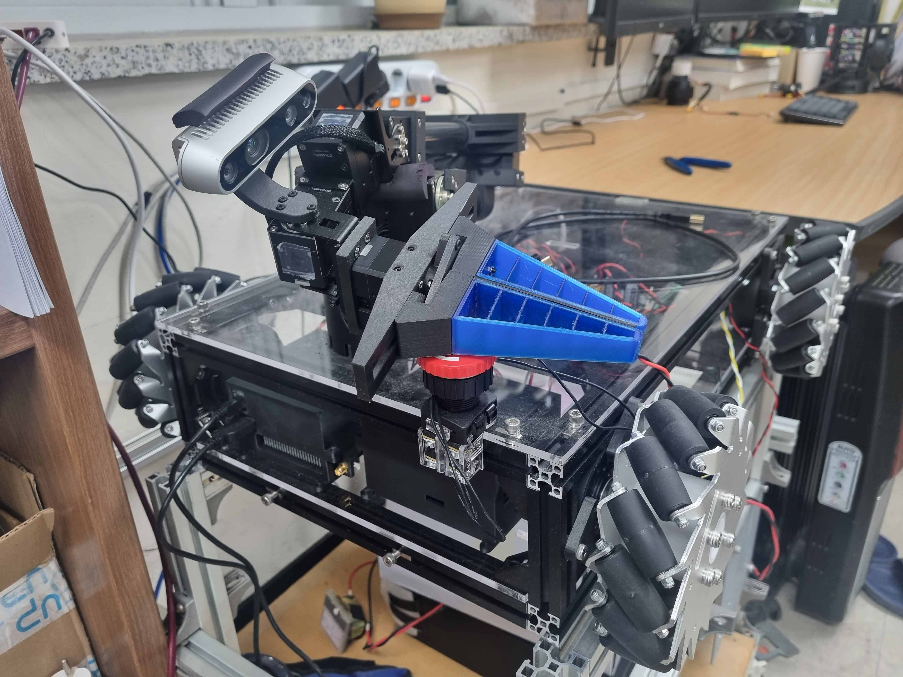
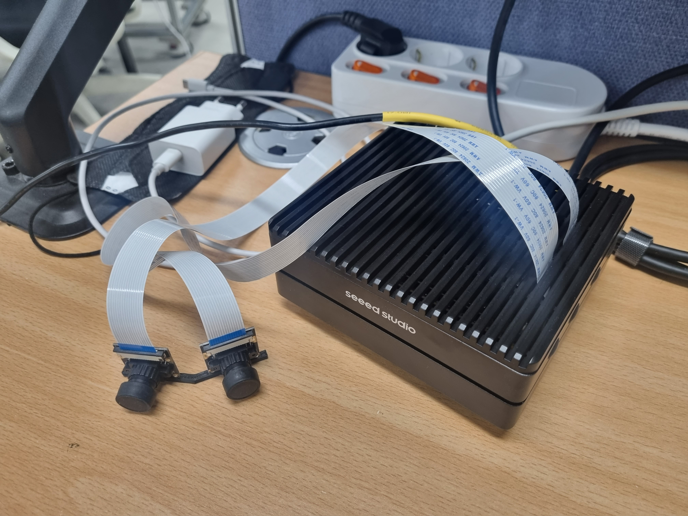
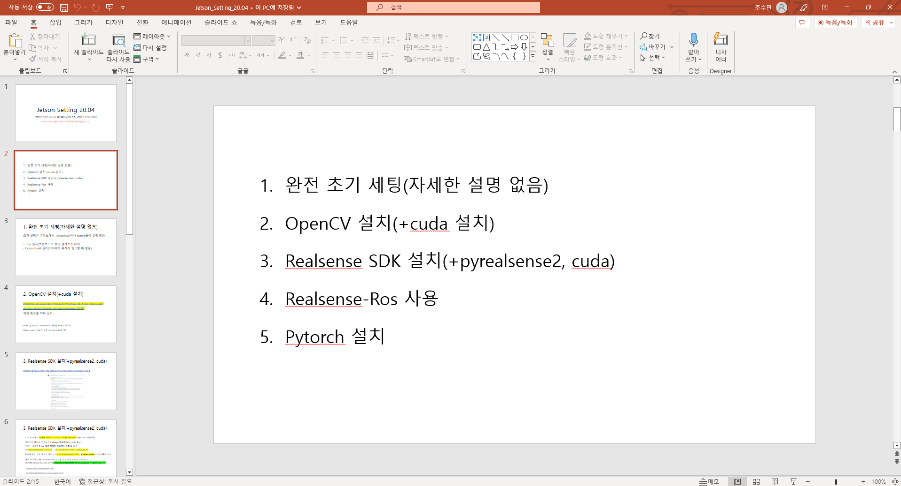
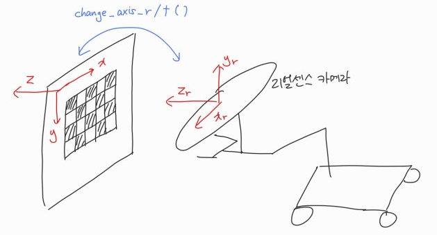
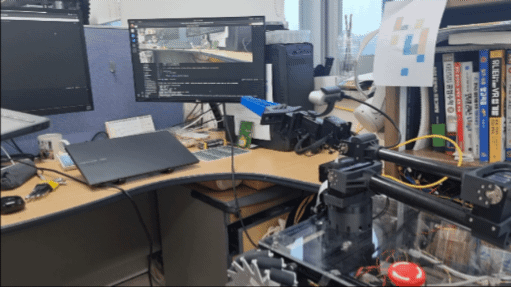

# st_arms_eyes :eyes:    
This is st_arms_eyes repository. I will put eyes on st_arm_prime which is myproject robot_arm with this project.(STECH 4-1 computer_vision project)   
_______________________________________________
Readme에 설명을 위한 gif 파일의 크기로 인해 이 리포지토리의 무게가 다소 무거워졌습니다. 이 리포지토리를 사용하신다면 readme_img 폴더의 파일들은 삭제하시는 것을 추천드립니다.   
_______________________________________________
   
   
이 로봇은 **ST_Arm_Prime**으로 기존에 개발중이던 ST_Arm v1,2,3 에서 베이스를 메카넘휠로 바꾸어 ***9Dof 구조***를 가진 모바일 로봇입니다. 캡스톤 디자인을 위해서 사용되고 있으며 현재까지 구축된 로봇은 **[구르반](https://github.com/palwanishan)**, **[이진우](https://github.com/ok701)** 선배님으로부터 개발된 Task Space PD 제어로 제어되는 매니퓰레이터입니다. 또한 이에 사용되는 GUI는 VR장비를 통해서 Unity의 디지털 트윈 로봇을 보며 제어가 가능합니다.   
   
기존의 GUI에서는 CSI 카메라와 리얼센스 카메라로부터 오는 정보를 그대로 읽어왔으나(가공을 거치지 않은 쌩 데이터를 C++ 기반의 패키지를 통해서 ROS로 읽어옴) 해당 부분을 수업에서 배운 Python을 사용한 컴퓨터 비전을 통해서 가공된 이미지로 제어에 영향을 줄 수 있도록 하고자 했습니다.   

&nbsp;

    
텀프로젝트 제안(당시에 정했던 목표) 내용

## 텀프로젝트 이름: st_arms_eyes(st_arm 로봇의 눈 만들어주기)
## 텀프로젝트 소개:     
현재 캡스톤디자인으로 VR로 제어하는 모바일 매니퓰레이터를 설계 및 제어를 진행하고 있습니다. 현재 제작한 로봇의 이름은 **st_arm_prime(st_arm_vMM)** 이며, 컴퓨터비전 과목 텀프로젝트를 진행하며 이 로봇에 눈을 달아주고자 합니다.(로봇에 달린 카메라를 통해 사용자가 편리하게 원격지의 로봇을 작동시킬 수 있도록 하고자 합니다.)   
   
VR기반의 모바일 로봇는 가상 공간에 있는 디지털 트윈 로봇을 사용자가 착용하고 있는 HMD를 통해서 최대 360도 전방향으로 주변을 볼 수 있게 해줍니다. 현재는 단순히 카메라들로부터 온 받은 이미지를 받기만 하고 있지만, 카메라 데이터를 가공하므로써 더욱더 VR기기 착용자가 더 실감나게, 더 편리하게 작동이 가능하게 하고자 합니다.   

 

### 프로젝트를 진행하며 가능하다면 하고 싶은 것들! (텀프로젝트 기간 내에 다 하지 못했더라도 이후 꾸준히 업데이트 할 예정)   
- 몸통에 달릴 CSI 카메라 등을 특징점을 통해 합침으로써 더욱더 넓은 시야를 얻을 수 있도록   
- 카메라를 통해서 얻은 정보를 통해 몸통의 위치 및 매니퓰레이터의 엔드이펙터의 자세를 추정   
- 오브젝트 인식 및 엔드이펙터 자세 결정(잡고자 하는 물체를 인식하고, 엔드이펙터의 자세를 만들어주기)   
   
  
이 프로젝트를 진행할 때, 이미지 처리에는 ***Jetson Orin NX 16GB***라는 임베디드 보드를 사용할 예정입니다.   
(이 보드는 초기에 CUDA가 OFF로 설정되어있음, arm 프로세서를 사용하기 때문에 리얼센스 카메라 설정과정이 다름 등의 이유로 초기 설정이 필요-->이 리포지토리에 설정법 ppt파일도 업로드 예정)

&nbsp; &nbsp;

&nbsp; &nbsp; &nbsp; &nbsp;
_______________________________________________
# 1. "st_arms_eyes :eyes: " 리포지토리 설명   
이 리포지토리에는 ***2개의 CSI 카메라와 1개의 realsense D435i 카메라***(RGB, Depth 이미지와 imu, gyro의 데이터(하지만 이 리포지토리에서 이미지와 가속도 센서를 동시 연결을 성공하지 못했습니다)를 사용하여 크게 다음의 내용을 담고 있습니다.   
- **1) 실시간 이미지 스티칭** :dog:   
- **2) 실시간 카메라 위치 인지 및 자세 유지를 위한 참조(Ref) 위치와의 오차 판단**   :cat:   
- **3) 객체 인식(엔드 이펙터를 통해 잡고자 하는 물체를 인식)** :bear:   

&nbsp; &nbsp;
리포지토리 내용을 설명 드리기 전에!!   
올해 3월과 5월에 Jetson Orin NX와 Jetson Orin Nano가 출시되었습니다. 하지만 ~~나중에 로봇이 움직이면서 실시간 이미지 처리를 빠르게 하려면 이런 보드가 있으면 좋을 것 같다고 교수님께 말씀드려서 구매한~~ 최신보드여서 아직 셋팅 관련 글이 많지 않아 애를 먹었습니다..   
혹시 이 리포지토리를 보시는 분들 중에 해당 보드를 사용하시는 분이 있다면 ppt 파일을 보시면서 따라하시면 세팅이 도움이 되실 거라고 생각합니다. 이 리포지토리의 내용을 젯슨 보드(jetpact 5.1, ubuntu20.04 기준)에서 사용하시려면 ppt에 있는 내용을 따라 pytorch 까지 설치가 되어야 합니다. (단, ppt의 내용으로 셋팅이 되기는 하나 올바른 방법인지는 잘 모르겠습니다..)   
   

&nbsp;
## 1) 실시간 이미지 스티칭 :dog:   
여기에서 사용되는 코드는 **1.rec_video.py**, **2.camera_calibration.py**, **3.realtime_camera_stitching.py**, **dual_camera_no_distortion.py** 입니다.

제가 사용한 CSI 카메라(IMX219 160도)는 젯슨에 최대 2개 연결 할 수 있습니다. 2개의 카메라를 실시간으로 이미지 스티칭을 진행하여 원격지의 로봇의 주변의 이미지를 사용자에게 제공한다면 사용자는 로봇을 작동함에 있어 조금 더 편하게 작동이 가능할 것입니다.   
이 카메라는 왜곡을 가지고 있기 때문에 우선적으로 카메라 캘리브레이션이 진행되어야 합니다. 이를 위해 우선적으로 1.rec_video.py를 수행하여 ***CSI 카메라로 부터 읽어온 카메라 데이터를 data 폴더에 저장*** 합니다.

&nbsp;
### :one: 1.rec_video.py   
   
이 코드는 gstreamer를 통해서 젯슨에 연결된 CSI 카메라로 획득한 이미지를 읽어옵니다. 읽어온 이미지는 imwrite를 통해서 ***output_l.mp4, output_r.mp4로 저장*** 합니다.    
이는 [JetsonHacksNano](https://github.com/JetsonHacksNano/CSI-Camera)가 제작한 CSI 카메라 연결코드를 기반으로 하였습니다.
&nbsp;

&nbsp;
### :two: 2.camera_calibration.py   
이 코드는 1. 을 통해서 저장한 영상들을 읽어오고 읽어온 영상을 사용하여 체커보드(체스보드)에서 특징점을 추출함으로써 카메라의 왜곡 정보를 얻어옵니다.
&nbsp;

&nbsp;
### :three: dual_camera_no_distrotion.py   
   
이 코드는 2. 를 통해서 얻은 카메라 정보를 기반으로 왜곡을 제거한 뒤, 2개의 CSI 카메라로 부터 얻어온 이미지를 가로로 연결하여 보여줍니다. 카메라의 왜곡을 없앴기 때문이 이미지의 외곽선이 변형되어있으며 빈공간은 검은 영역으로 나타나게 됩니다. (1~3 과정에서 크게 필요는 없지만 카메라 렌즈에 불순물이 붙는 등의 일로 인해 3.에서 실시간 카메라 이미지 스티칭이 잘 수행이 되지 않을 때 디버깅을 위해서 생성한 코드입니다)
&nbsp;

&nbsp;
### :four: 3.realtime_camera_stitching.py   
   
이 코드는 카메라의 왜곡을 보완하여 얻은 두 개의 카메라 이미지로부터 **RANSAC**을 통해 **H**(왼쪽 카메라 이미지에 대한 오른쪽 카메라 이미지의 이미지 변환행렬)을 얻어 실시간으로 스트리밍 되는 이미지를 연결해줍니다. 실시간으로 H를 반복하여 구할 경우 연산 증가로 인해 딜레이가 심하게 발생하기 때문에 ***처음에만 H를 얻고 이후에는 이때 구한 H를 기반으로 이미지를 스티칭*** 합니다. 하지만 H가 잘 구해지지 못했을 경우 사용자는 ***엔터를 눌러서 H를 다시 구할 수 있습니다.***

&nbsp; &nbsp;
## 2) 실시간 카메라 위치 인지 및 자세 유지를 위한 오차 판단 :cat:   
여기에서 사용되는 코드는 **endeffector_camera.py**, **endeffector_camera_imu.py**, **4.endeffector_looking_book.py**, **5.find_endeffecor_pose_error.py** 입니다.

RGBD 카메라는 두 개의 카메라를 조합하여 얻은 Depth 정보를 반환하는 카메라입니다. 제가 사용한 카메라는 Intel realsense D435i 카메라로 RGB 이미지는 기존 카메라들과 동일하나 Depth 이미지는 3차원 데이터에서 RGB 이미지에서 채널에 해당하는 축의 데이터는 1개의 채널로 구성되어있으며 (제가 테스트하며 확인한바로는) uint16형의 깊이 정보를 반환해줍니다.   
   
뎁스 카메라를 사용하게 되면 얻는 깊이 정보를 기반으로 treshold가 가능하다는 장점을 가집니다.(RGB 카메라 하나만 사용할 때에 비해서 빛 등에 의한 영향이 줄어듦) 그 외에도 3D 정보로 만들어 공간을 인식하게 만들 수 있습니다. (하지만 시간상 이번 텀프로젝트에서 해당 내용은 너무 어려워 이 리포지토리에는 그러한 내용이 없습니다.)

&nbsp;
### :one: endeffector_camera.py   
   
이 코드는 엔드이펙터에서 사용하는 realsense D435i 카메라를 사용하기 위한 코드입니다. Intel realsense에서 제공하는 realsense SDK를 통해서 인식한 카메라를 **pyrealsense2** 패키지를 사용하여 카메라의 이미지를 읽어오는 방식으로 작동합니다. 왼쪽이는 카메라가 읽어온 RGB 이미지, 오른쪽에는 카메라가 읽어온 Depth 이미지를 확인할 수 있습니다.    
이는 realsense에서 제공해준 [예시코드](https://github.com/IntelRealSense/librealsense/tree/master/wrappers/python/examples)를 기반으로 하였습니다.
&nbsp;

&nbsp;
### :two: endeffector_camera_imu.py   
   
이 코드는 엔드이펙터에서 사용하는 realsense D435i 카메라에서 ***imu 정보를 얻어오는 코드***입니다. RGBD 데이터를 동시에 사용하는 법을 아직 찾지 못하였고, 이후에 이 데이터를 가공(위치, 속도로 누적 및 오차 누적 필터링)하기에는 시간이 부족할 것이라 판단하여 만들기만 하고 사용하지 않았습니다.
&nbsp;

&nbsp;
### :three: 4.endeffector_looking_book.py   
   
[mini_AR_magicalzone](https://github.com/1213tnals/mini_AR_magicalzone)을 진행한 것을 바탕으로 카메라 및 AR 이미지의 자세를 알고자 만들어졌습니다. 잡고자 하는 물체가 있는 환경에서 찾은 점들을 통해서 엔드 이펙터가 그 위치를 따라가고자 할 때 보고 있는 방향이 달라지더라도 박스의 위치를 알 수 있게 하고자 하였습니다. 하지만 카메라가 이동하여 물체에 반사된 빛을 받거나 그림자가 생기거나, 특징정을 잃게 되면 AR 이미지가 사라지기 때문에 다른 방법이 필요해졌습니다.
&nbsp;

&nbsp;
### :four: 5.find_endeffecor_pose_error.py   
   
이 코드는 4.에서 진행한 책 위에서의 가상의 물체의 다양한 위치에서 보기가 불가능을 인지하고, 상대적으로 오차가 잘 발생하지 않는 체커보드(체스보드)에서 진행한 코드입니다.   
   
엔드 이펙터의 카메라가 체커보드의 중앙에 평행하게 위치하기 원할 경우 **오차인 e(ref_X{:참조 포즈} - act_X{실제 포즈})**에 **상수 K를 곱**하여 힘을 발생할 수 있습니다. 엔드 이펙터가 움직일 때를 두가지 단계(1. XY 평면내에서의 움직임-x,y,roll / 2. Z방향을 고려한 움직임-z,pitch,yaw)로 나누었습니다. 따라서 이를 위한 오차 e를 로봇에 넣어주기 위한 코드이며, 사용자는 ***이미지의 왼쪽 위에 나오는 데이터를 통해서 추종하고자 하는 자세와 얼만큼의 오차가 발생하고 있는지*** **xyz, rpy(roll,pitch,yaw)에 대한 오차를 확인**할 수 있으며, ***이미지의 왼쪽 아래에 나타나는 데이터를 통해서 엔드 이펙터가 1,2단계 중 어떤 단계를 수행해야하는지를 알 수 있습니다.***   
   
여기서 오차를 만드는 과정에 있어, 카메라의 좌표와 이미지의 좌표를 바꿀 필요가 있었습니다. 따라서 이를 위해서 아래의 이미지와 같이 *** 축방향의 값을 변환 *** 하여 오차의 값으로 정상적으로 생성할 수 있도록 하는 함수를 사용하였습니다. 이때 출력된 값은 rad에서 deg 단위로 변환한 함수를 거친 값입니다.   
   

&nbsp; &nbsp;
## 3) 객체 인식   
여기에서 사용되는 코드는 **6.camera_treshold_contour.py**, **8.realsense_img_save.py**, yolov5 폴더 안에 있는 **9.object_detect_using_depthNyolov5.py** 입니다. 로봇팔은 특정한 동작을 수행할 수 있게 합니다. 따라서 어떠한 물체를 잡는 등의 동작을 하려면 해당 물체를 인식하는 과정이 로봇팔에서는 매우 유용합니다. 따라서 이를 위한 객체 인식을 진행하였습니다.   

&nbsp;
### :one: 6.camera_treshold_contour.py :bear:   
   
이 코드는 뎁스 카메라를 통해서 ***20cm~30cm*** (D435i 카메라는 20cm 이내의 이미지는 잘 인식 못함, 코드를 통해 최대거리를 30cm로 제한) 떨어진 범위로 treshold한 Depth 이미지를 이진화 하여 이를 가중치 행렬로 사용하고 RGB 이미지에 가중치를 곱함으로써 해당 깊이에 대한 RGB 이미지만 뽑아 보여줍니다. RGB 이미지만 잘 보이게 하기 위해서 컨투어를 따서 파란선으로 표시하였으며 뎁스 이미지로 이진화한 데이터의 경계가 다소 거친 부분이 있어 ***erode와 dilate로 노이즈를 제거하고 blur를 통해서 외곽을 조금 부드럽게 변경*** 하였습니다. 그리고 인식된 영역의 중앙점은 **connectedComponentsWithStats()** 라는 함수가 영역내의 중앙지점을 반환하는 함수라 하여 이를 이용하여 영역의 ***중앙을 빨간색 원이 따라갈 수 있도록*** 하였습니다.   
   
하지만 RGB 카메라 이미지와 Depth 카메라 이미지의 중심점이 동일하지 않아 물체가 다소 깔끔하게 인식되지 못한 문제가 있었습니다. 이 코드를 통해서 학습이 되어있지 않은, ***"순수 unknown인 물체도 잘 인식해서 물체를 인지할 수 있게 하자"*** 였지만 뎁스를 그대로 사용할 경우 책상을 함께 인식해버리는 등의 문제가 발생하였기 때문에 이 코드는 이후 객체 인식 알고리즘을 사용한 **yolov5**를 사용하는 것으로 넘어가게 되었습니다.
&nbsp;

&nbsp;
### :two: 8.realsense_img_save.py   
이 코드는 yolov5 사용하기 위해 학습할 이미지를 생성하는 코드입니다. 다른 카메라를 사용하여 촬영하기보다 사용할 엔드 이펙터+Depth 카메라로 이미지를 뽑아 라벨링을 하는 것이 좋다고 판단하여 이 코드를 만들어 사용하였습니다. 사용자는 원하는 위치로 카메라를 위치시키고 엔터를 반복적으로 누르면 ***1,2,3, ..., n 장의 카메라를 반복해서 저장*** 할 수 있습니다. 마지막으로 esc를 누르게 되면 사진 저장은 종료되며, 다시 사용할 경우 count가 0부터 시작하므로 기존에 촬영한 이미지가 지워질 수 있으니 주의바랍니다.
&nbsp;

&nbsp;
### :three: 9.object_detect_using_depthNyolov5.py   
   
이 코드는 **[yolov5](https://github.com/ultralytics/yolov5)**를 사용하여 학습된 이미지를 인식합니다. 이때 엉뚱한 물체를 인식하는 것을 줄이기 위해 RGBD 카메라의 장점을 살려, **설정한 Depth 인지 거리 내에서만 물체를 인식**할 수 있도록 6.에서 사용한 RGB 이미지의 필터링을 사용하였습니다. 이를 통해 엔드 이펙터의 카메라가 원하는 물체만 인식하게 하는 것이 조금 더 안전하게 작동합니다. 라벨링은 **labelimg** 라는 툴을 사용하였습니다.   
&nbsp; &nbsp;

# 2. 전체 영상 보기 및 실제 로봇과 작동   

   
### [유튜브를 통해서 작동 전체 영상보기](https://youtu.be/r5T2MlfNaQg)   
-타임라인-   
실제 로봇만 보기: [06:35](https://www.youtube.com/watch?v=r5T2MlfNaQg&t=395s)  
00:15~06:35 는 코드 작동으로 나오는 화면 녹화영상입니다.   
   
### 텀프로젝트를 마치며
최근 로봇분야를 배우기 시작하면서 기존부터 관심 갖고 있던 컴퓨터 비전을 로봇에 적용해보고 싶었음. 현재 캡스톤 디자인으로 진행하고 있는 로봇이 카메라로 실시간 스트리밍만 하고 있었기 때문에 이 카메라를 잘 활용하여 로봇이 카메라를 통해서 주변을 인식할 수 있게 하고 싶었음. 이전의 **[커피 로봇](https://github.com/1213tnals/MobileCoffeeMachineControl-by-Handcontrolling)**에서는 단순히 왼쪽 모터를 돌린다/오른쪽 모터를 돌린다 의 방식이었기 때문에 실제 로봇을 직접 움직일 수 있었지만, 로봇팔의 경우 제어하기 위해 구성해야할 것이 많아 이 프로젝트에서는 중력보상을 사용하여 로봇이 마지막 자세를 유지하게 하고 그 때의 결과를 화면으로만 보게 한 것이 아쉬움. 하지만 텀프로젝트 기간 이후에 이것이 가능하도록 할 예정.   

   
### 참고한 오픈소스   
라이선스: Apache License Version 2.0, Apache License Version 3.0 - yolov5    
https://github.com/jetsonhacks/CSI-Camera   
https://github.com/IntelRealSense/librealsense      
https://github.com/ultralytics/yolov5   
https://github.com/mint-lab/cv_tutorial :star:   