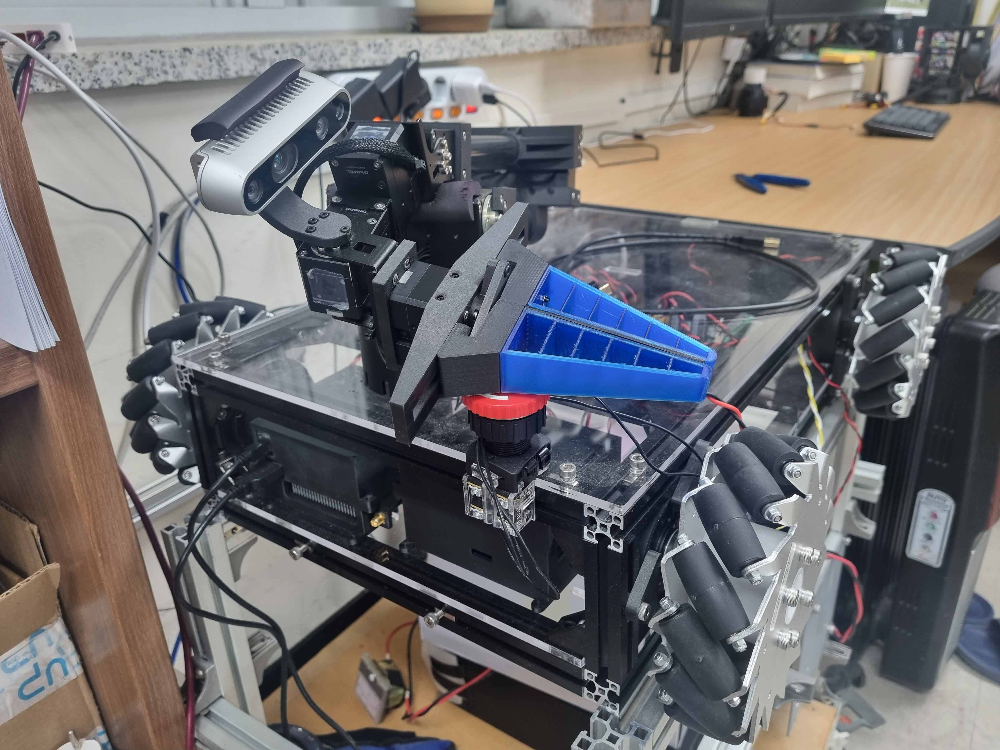
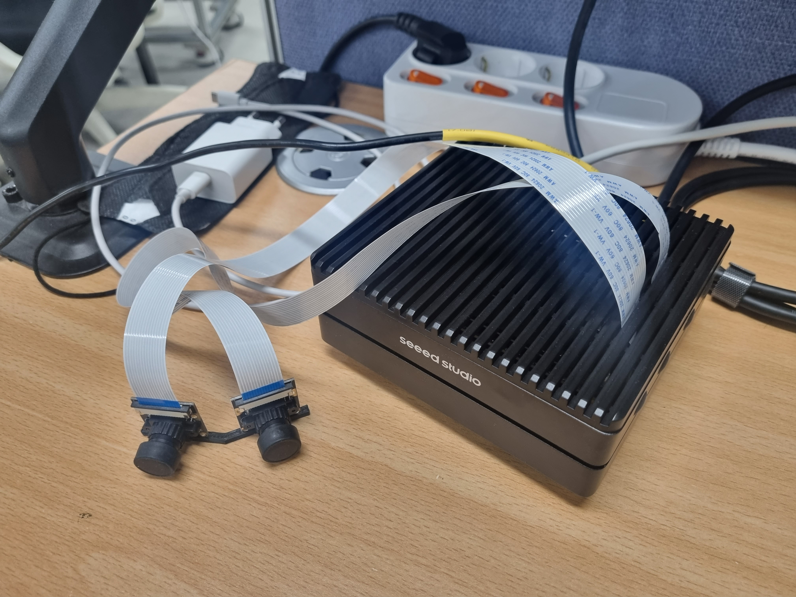

# st_arms_eyes   
This is st_arms_eyes repository. I will put eyes on st_arm_prime which is myproject robot_arm with this project.(STECH 4-1 computer_vision project)   
   

  
   
## 텀프로젝트 이름: st_arms_eyes(st_arm 로봇의 눈 만들어주기)
## 텀프로젝트 소개:     
현재 캡스톤디자인으로 VR로 제어하는 모바일 매니퓰레이터를 설계 및 제어를 진행하고 있습니다. 현재 제작한 로봇의 이름은 **st_arm_prime(st_arm_vMM)** 이며, 컴퓨터비전 과목 텀프로젝트를 진행하며 이 로봇에 눈을 달아주고자 합니다.(로봇에 달린 카메라를 통해 사용자가 편리하게 원격지의 로봇을 작동시킬 수 있도록 하고자 합니다.)   
   
VR기반의 모바일 로봇는 가상 공간에 있는 디지털 트윈 로봇을 사용자가 착용하고 있는 HMD를 통해서 최대 360도 전방향으로 주변을 볼 수 있게 해줍니다. 현재는 단순히 카메라들로부터 온 받은 이미지를 받기만 하고 있지만, 카메라 데이터를 가공하므로써 더욱더 VR기기 착용자가 더 실감나게, 더 편리하게 작동이 가능하게 하고자 합니다.   

 

### 프로젝트를 진행하며 가능하다면 하고 싶은 것들! (텀프로젝트 기간 내에 다 하지 못했더라도 이후 꾸준히 업데이트 할 예정)   
- 몸통에 달릴 CSI 카메라 등을 특징점을 통해 합침으로써 더욱더 넓은 시야를 얻을 수 있도록   
- 카메라를 통해서 얻은 정보를 통해 몸통의 위치 및 매니퓰레이터의 엔드이펙터의 자세를 추정   
- 오브젝트 인식 및 엔드이펙터 자세 결정(잡고자 하는 물체를 인식하고, 엔드이펙터의 자세를 만들어주기)   
   
  
이 프로젝트를 진행할 때, 이미지 처리에는 ***Jetson Orin NX 16GB***라는 임베디드 보드를 사용할 예정입니다.   (이 보드는 초기에 CUDA가 OFF로 설정되어있음, arm 프로세서를 사용하기 때문에 리얼센스 카메라 설정과정이 다름 등의 이유로 초기 설정이 필요-->이 리포지토리에 설정법 ppt파일도 업로드 예정)